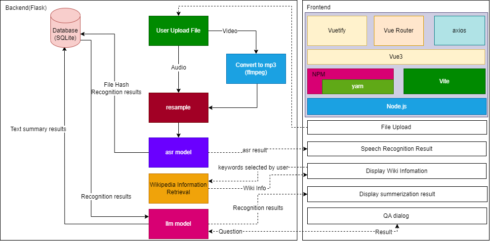

# AudioTranscribeAI


## Installation

This project is working with [Python 3.8.8+](https://www.python.org/), 
you should have it installed on your machine.

### Set up the backend

#### Install the requirements
```bash
pip install -r requirements.txt
```

### Set up the frontend

The frontend is inside the `frontend/AudioTranscribeAI` folder.

The application is built with node.js and vue.js.

So to start the server, you need to install the [node.js](https://nodejs.org/en/download) and yarn package manager.

```bash
npm install --global yarn
```

#### Install the requirements
```bash
yarn --cwd frontend/AudioTranscribeAI/  # if you are in the root directory
# or
cd frontend/AudioTranscribeAI 
yarn # if you are in the frontend/AudioTranscribeAI directory
```

## Run the application

Because we are using separate backend and frontend architecture, so we need to run both of them.

### Run the backend

```bash
python app.py
```
### Run the frontend

```bash
yarn --cwd frontend/AudioTranscribeAI/ dev # if you are in the root directory
# or
cd frontend/AudioTranscribeAI 
yarn dev # if you are in the frontend/AudioTranscribeAI directory
````

## Other commands for the frontend

### Build the release version of frontend application
```bash
yarn --cwd frontend/AudioTranscribeAI/ build # if you are in the root directory
# or
cd frontend/AudioTranscribeAI 
yarn build # if you are in the frontend/AudioTranscribeAI directory
```

# Architecture



## Machine Learning Model

### Speech Recognition

✨Model: [openai/whisper-small](https://huggingface.co/openai/whisper-small)

### Large Language Model (Text Summarization and Question Answering)

✨Model: 
- Default: [TinyLlama/TinyLlama-1.1B-Chat-v1.0](https://huggingface.co/TinyLlama/TinyLlama-1.1B-Chat-v1.0)
- Alternative: [meta-llama/Llama-2-7b-chat-hf](https://huggingface.co/meta-llama/Llama-2-7b-chat-hf)

### NLP Model
✨Model [spacy](https://spacy.io/): [en_core_web_sm](https://spacy.io/models/en)

### Wikipedia Retrieval
- [PyDictionary](https://pypi.org/project/PyDictionary/) package
- [pywikibot](https://pypi.org/project/pywikibot/) package
- Text processing with [nltk](https://pypi.org/project/nltk/) package

## Backend
- [Flask](https://flask.palletsprojects.com/en/3.0.x/)
- [sqlite3](https://docs.python.org/3/library/sqlite3.html)
- [Flask-CORS](https://flask-cors.readthedocs.io/en/latest/)

## Frontend
- [Vue.js](https://vuejs.org/)
- [Vuetify](https://vuetifyjs.com/en/)
- [axios](https://axios-http.com/)
- [npm](https://www.npmjs.com/)
- [yarn](https://yarnpkg.com/)
- [vue-router](https://router.vuejs.org/)

# Evaluation
For aduio model evaluation, we use the [LibriSpeech](https://huggingface.co/datasets/librispeech_asr) dataset.

`cd asr && python eval_asr.py`